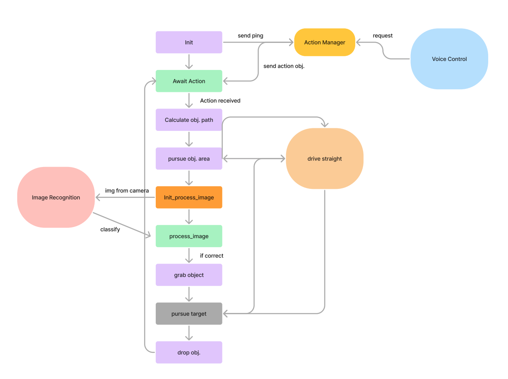

# Final-Project: RoboCourier

## Project Description

**Goal:**
The goal of RoboCourier is to develop an autonomous robot capable of delivering items within a predefined environment. This project explores the integration of robotics algorithms for navigation, object detection, and manipulation to achieve efficient and reliable item delivery.

**Motivation:**
Our team is passionate about automating routine tasks through robotics, and we are eager to explore how robotics can be integrated into everyday environments. The RoboCourier project aims to streamline the management and distribution of soda bottles, thereby reducing mundane tasks and increasing efficiency. This project will not only allow us to delve into complex robotics algorithms, such as pathfinding and localization, but also challenge us to integrate advanced computer vision technologies, enhancing both our learning and technical skills.

**Robot Functionality:**
RoboCourier is designed to navigate through an environment, identify delivery locations, pick up soda bottles, and deliver them to specified destinations using a combination of sensors and algorithms.

**Main Components:**
- **Navigation:** Using a hard-coded maze based on measurements of each node in the environment. Pathfinding is implemented using both the A* and Dijkstra's algorithms to determine the shortest path.
- **Object Detection:** Implementing computer vision techniques for identifying soda bottles.
- **Manipulation:** Using robotic arms for picking up and placing soda bottles.

## System Architecture

**Navigation:**
- **Hard-coded Maze:** The robot uses a hard-coded maze based on measurements of each node in the environment. The maze data is stored in `adjacency.csv` under the `script` folder.
- **Path Planning:** Implemented using both A* and Dijkstra's algorithms to find the shortest path in the maze.

**Object Detection:**
- **Computer Vision:** The robot employs a camera and image processing algorithms to detect and recognize soda bottles and delivery points.
- **Sensor Integration:** Data from various sensors are used to enhance detection accuracy.

**Manipulation:**
- **Robotic Arm Control:** The robot’s arm is controlled using inverse kinematics to pick up and place soda bottles accurately.
- **Gripper Mechanism:** A gripper is used to handle different objects securely.

**Flowchart:**


## Demo Video

https://github.com/terastion/robotics-final-project/assets/46730580/f7a956f5-2fd2-4b56-a28f-ef5be80ba267

## ROS Node Diagram for RoboCourier

1. **Nodes:**
   - **Action Manager Node:** Manages and dispatches actions based on requests from Voice Control.
   - **Image Classification Node:** Processes images from the camera and classifies objects.
   - **Main Node:** Manages the robot’s movement, including driving and pursuing objects. Also handles the camera and robot arm movements.

2. **Topics:**
   - `/robocourier/state`: Used by Main Node to notify Action Manager that it is ready to receive a new task.
   - `/robocourier/robot_action`: Used by Action Manager to send the next action (object to retrieve) to the Main Node.
   - `/camera/rgb/image_raw`: Used by the Main Node to ensure that the robot follows the maze lines, as well as for performing image recognition.
   - `/robocourier/image_input`: Used by the Main Node to send an image to the Image Classification node.
   - `/robocourier/image_output`: Used by the Image Classification node to send the classification result back to Main Node.
   - `/cmd_vel`: Used by the Main Node for moving the robot.
   - `/debug/range_update`: A debugging node used for adjusting the line maze color detection ranges (using `range_updater.py`)


### ROS Node Diagram
```plaintext
Action Manager Node             Main Node                Image Classification Node
   |<--/robocourier/state---        |                              |
   |--/robocourier/robot_action---->|                              |
   |                                |--/robocourier/image_input--->|
   |                                |<--/robocourier/image_output--|
   |                                |                              |
   |                            |/cmd_vel|                         |
   |                     |/camera/rgb/image_raw|                   |
```

### Explanation:
- **Action Manager Node** handles user voice requests and sends action commands to the **Main Node**.
- **Main Node** handles the navigation of the robot and movement of its arm. Also handles the robot camera which helps the robot follow the maze lines. Also sends images from the camera to the Image Classification Node.
- **Image Classification Node** receives images from the Main Node for processing, and publishes classifications for the Main Node to see.

## Execution
Generate an OpenAI API Key, put the API key in `client = OpenAI(api_key = "API key")` within both `main_node.py` and `action_manager.py`.

Replace the `music.mp3`'s absolute path in `play_music.py` with its absolute path in your environment
  
`roscore`

`ssh pi@<YOUR_TURTLEBOT_IP>` and `bringup`

`ssh pi@<YOUR_TURTLEBOT_IP>` and `bringup_cam`

`roslaunch turtlebot3_manipulation_bringup turtlebot3_manipulation_bringup.launch`

`roslaunch turtlebot3_manipulation_moveit_config move_group.launch`

`roslaunch robocourier action.launch`

> **Note:** If you encounter any troubles, it is likely due to missing libraries. Use  `pip install XXX` command to install necessary libraries.

## Challenges, Future Work, and Takeaways

**Challenges:**
- **Navigation Accuracy:** Due to the proximity of the orange lines in the maze, the camera often detects orange pixels outside of its intended path, which causes the robot to veer slightly off course, which could mean that the robot fails to grab the desired object. This is not a challenge that we were able to resolve fully due to the position and angle of the camera. However, one strategy we used to reduce the likelihood of this is to prioritize the detection of orange pixels towards the middle of the camera image. This decreased the likelihood of the robot from veering off course due to the camera having stray orange pixels in its image.
- **Image Recognition**: None of the team members had a lot of experience using PyTorch or other image recognition models, so it took a lot of time and searching to figure out a good approach. Eventually, we settled on training our own image recognition model by taking thousands of pictures of the objects using the robot camera. This approach led to much greater accuracy in image detection over trying to fine-tune a previously trained model.

**Future Work:**
- **Enhanced Object Detection:** Given our success with the image recognition model, it could be possible to adapt it to recognize even more types of bottles, expanding the possible objects it can recognize. This would involve taking more pictures of the bottles using the robot camera and training a new model using this data. However, for the sake of our project and the small maze we are working with, we chose to train an image recognition model for just 3 different bottles.
- **Multi-Robot Coordination:** One feature we wanted to explore during this project but could not was the possibility of having more than one robot performing delivery tasks simultaneously. This would involve the two robots communicating with each other so as to avoid colliding paths. This would also involve rewriting the main path-finding algorithm to take other robot(s)'s positions into account when finding the shortest path to an object.

**Takeaways:**
- Understanding the challenges and solutions in autonomous navigation and object handling.
- Insights into the integration of various robotics components and algorithms.
- Learn how to train and use an image recognition model.


## GitHub Repository

**Link:** [RoboCourier GitHub Repo](https://github.com/terastion/robotics-final-project)

## Summary

In summary, RoboCourier demonstrates the successful integration of navigation, object detection, and manipulation for autonomous item delivery. Through this project, we tackled various challenges, learned valuable lessons, and identified areas for future improvement, showcasing the potential of robotics in automating delivery tasks.
